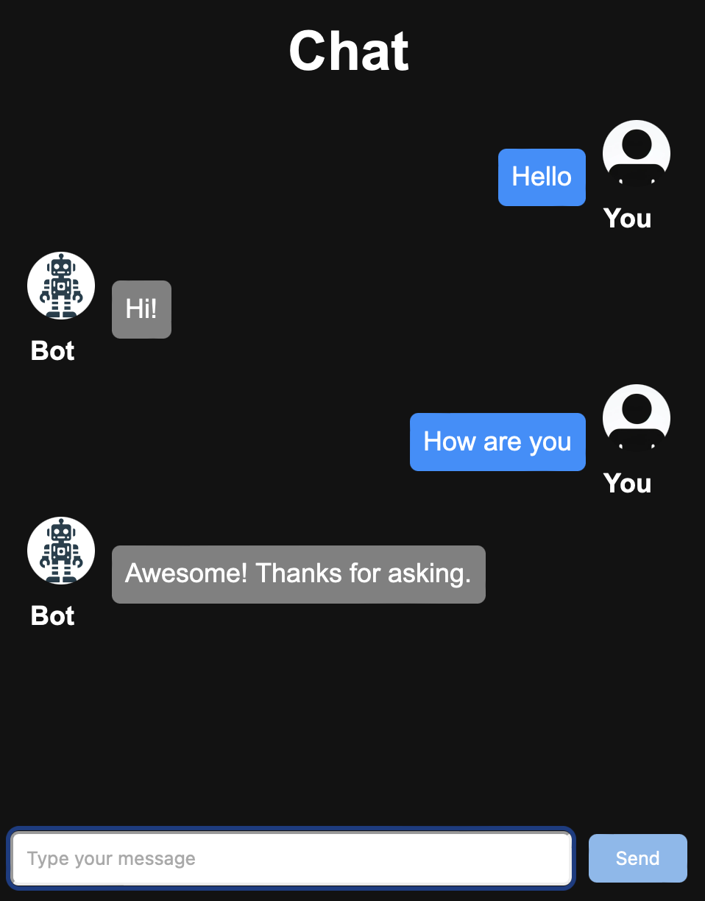

# My-GPT

## Introduction

This NLP Chatbot leverages TensorFlow and React to provide an engaging and interactive user experience. Built with cutting-edge machine learning algorithms, our chatbot is capable of understanding and processing natural language inputs, making it an ideal solution for various applications, including customer service, information retrieval, and interactive storytelling. The integration with React allows for a seamless and responsive web interface, ensuring users have a smooth interaction with our AI.

## Features

• Natural Language Understanding: Utilizes TensorFlow's advanced NLP capabilities to interpret user inputs.
• Responsive Design: Built with React, the chatbot interface is fully responsive and user-friendly, adaptable to both mobile and desktop devices.
• Customizable Responses: Easy customization of responses to fit various scenarios and industries.
• Analytics Dashboard: Integrated analytics to track user interactions and improve the chatbot's performance over time.